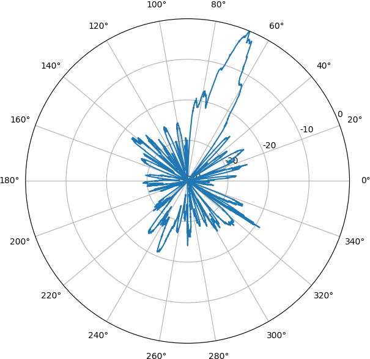

Scripts, Python modules and GNU Radio companion examples for measuring the
reception power of an antenna during rotation, and for doing the necessary
off-line analysis to produce antenna diagrams.

The code here is described in a blog post, https://www.la1k.no/?p=2579.

Use `rotctld_angle_printer.py` to print timestamp + angle to file. See
docstring of `rotctld_angle_printer.py` for more details. Let this run
continuously while collecting GNU Radio samples and turning the rotor.

Run grc_uhd_to_iq.grc in GNU Radio companion to collect IQ samples for later
power spectrum estimation, or run grc_uhd_to_power_spectrum.grc to estimate
power spectra directly for selected FFT bins.

Use `combine_samples_and_angles.py` to combine samples/power estimates produced
using GNU Radio with the above angle measurements.  See docstring of
`combine_samples_and_angles.py` for more details.

For time-varying, periodic morse signals, see docstring of `cw_extraction.py`.
Its behavior is described in https://www.la1k.no/2018/06/27/extracting-the-antenna-pattern-from-a-beacon-signal-pt-i-initial-investigations-using-autocorrelation/, https://www.la1k.no/2018/07/04/extracting-the-antenna-pattern-from-a-beacon-signal-pt-ii-measurements-of-la2shf/ and https://www.la1k.no/?p=2960.
